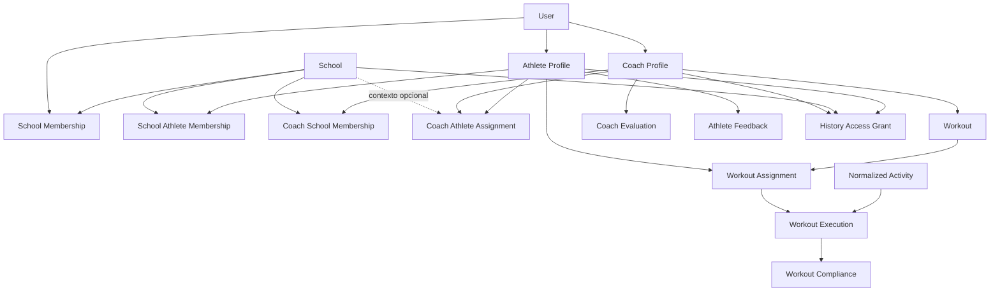

# Ryvano Escola — Design Técnico

**Arquivo:** `design.md`  
**Módulo:** Escola  
**Base funcional:** `required.md`  
**Status:** Design técnico inicial para implementação  
**Objetivo:** transformar os requisitos funcionais do módulo Escola em uma proposta técnica concreta de domínio, persistência, contratos, eventos, autorização, APIs e integrações.

---

# 1. Objetivos deste documento

Este documento define:

- arquitetura do módulo;
- fronteiras de domínio;
- entidades;
- tabelas;
- colunas principais;
- relacionamentos;
- índices;
- constraints;
- enums;
- eventos de domínio;
- serviços de aplicação;
- comandos;
- queries;
- endpoints;
- DTOs;
- autorização;
- auditoria;
- estratégia de histórico temporal;
- estratégia de convites;
- lobby;
- prescrição;
- execução;
- matching treino ↔ atividade;
- compliance;
- compartilhamento de histórico;
- integração com atividades normalizadas;
- extensibilidade futura.

---

# 2. Princípios técnicos

A implementação deverá obedecer aos seguintes princípios:

1. histórico esportivo não pertence à escola;
2. vínculos são temporais;
3. autoria é imutável;
4. acesso e propriedade são conceitos diferentes;
5. escola e professor são relacionamentos, não campos fixos no atleta;
6. o módulo Escola não depende diretamente de Garmin/Strava;
7. toda autorização é validada no backend;
8. soft delete/inativação é preferível para entidades históricas;
9. mudanças sensíveis devem ser auditadas;
10. o domínio deve suportar evolução para múltiplas escolas e múltiplos coaches.

---

# 3. Bounded contexts sugeridos

O módulo não deve concentrar tudo em um único pacote gigantesco.

Sugestão:

```text
modules/
  school/
  coaching/
  training/
  athlete-history/
  audit/
```

## 3.1 school

Responsável por:

- escolas;
- membros;
- papéis;
- professores vinculados;
- atletas vinculados;
- lobby;
- convites;
- aprovações;
- administração.

## 3.2 coaching

Responsável por:

- coach profile;
- coach independente;
- atribuição coach ↔ atleta;
- períodos de acompanhamento.

## 3.3 training

Responsável por:

- treino;
- template;
- blocos;
- atribuição;
- execução;
- matching;
- compliance;
- avaliações;
- feedback.

## 3.4 athlete-history

Responsável por:

- grants;
- escopo de compartilhamento;
- períodos;
- regras de leitura histórica.

## 3.5 audit

Responsável por:

- trilha de auditoria;
- registros de mudanças;
- contexto da ação.

---

# 4. Diagrama de alto nível



---

# 5. Identidade e perfis

Assumimos que já existe uma identidade principal de usuário na Ryvano.

Não duplicar usuário dentro do módulo.

Sugestão conceitual:

```text
User
AthleteProfile
CoachProfile
```

Um mesmo `User` poderá ter:

- AthleteProfile;
- CoachProfile;
- ambos.

---

# 6. Tabela `schools`

Representa uma escola/organização esportiva.

```text
schools
```

Campos sugeridos:

```text
id                  uuid pk
slug                varchar unique
name                varchar not null
description         text null
logo_url            text null

status              school_status not null

owner_user_id       uuid not null

join_policy         school_join_policy not null
coach_selection_policy coach_selection_policy not null

created_at          timestamptz not null
updated_at          timestamptz not null
deactivated_at      timestamptz null
archived_at         timestamptz null
```

---

# 7. Enum `school_status`

```text
ACTIVE
INACTIVE
SUSPENDED
ARCHIVED
```

Para o MVP:

```text
ACTIVE
INACTIVE
```

---

# 8. Enum `school_join_policy`

```text
AUTO_APPROVE
REQUIRE_APPROVAL
INVITE_ONLY
```

MVP mínimo:

```text
AUTO_APPROVE
REQUIRE_APPROVAL
```

---

# 9. Enum `coach_selection_policy`

Define como o atleta recebe professor ao entrar.

```text
ATHLETE_CHOOSES
ADMIN_ASSIGNS
AUTO_LOBBY
INVITE_DEFINES_COACH
```

---

# 10. Tabela `school_memberships`

Representa membros administrativos/operacionais da escola.

```text
school_memberships
```

Campos:

```text
id              uuid pk
school_id       uuid fk schools
user_id         uuid fk users

status          membership_status

started_at      timestamptz not null
ended_at        timestamptz null

created_at      timestamptz not null
updated_at      timestamptz not null
```

Constraint lógica:

> somente um vínculo ativo equivalente por `school_id + user_id`.

---

# 11. Enum `membership_status`

```text
PENDING
ACTIVE
REJECTED
REVOKED
ENDED
```

---

# 12. Tabela `school_membership_roles`

Permite múltiplos papéis por membro.

```text
school_membership_roles
```

Campos:

```text
id                      uuid pk
school_membership_id    uuid fk school_memberships
role                    school_role
created_at              timestamptz not null
```

Unique:

```text
school_membership_id + role
```

---

# 13. Enum `school_role`

```text
OWNER
ADMIN
COACH
ASSISTANT_COACH
STAFF
ATHLETE
GUARDIAN
```

Observação:

`ATHLETE` pode não precisar viver nesta tabela se a associação do atleta for tratada exclusivamente por `school_athlete_memberships`.

A recomendação é:

- papéis administrativos/operacionais em `school_membership_roles`;
- vínculo esportivo do atleta em `school_athlete_memberships`.

---

# 14. Tabela `coach_profiles`

Perfil de treinador independente de escola.

```text
coach_profiles
```

Campos:

```text
id              uuid pk
user_id         uuid unique not null
display_name    varchar not null
bio             text null
status          coach_status
created_at      timestamptz not null
updated_at      timestamptz not null
```

---

# 15. Enum `coach_status`

```text
ACTIVE
INACTIVE
SUSPENDED
```

---

# 16. Tabela `coach_school_memberships`

Relaciona professor a escola.

```text
coach_school_memberships
```

Campos:

```text
id              uuid pk
coach_id        uuid fk coach_profiles
school_id       uuid fk schools

status          membership_status

started_at      timestamptz not null
ended_at        timestamptz null

approved_by     uuid null
approved_at     timestamptz null

created_at      timestamptz not null
updated_at      timestamptz not null
```

Constraint:

- impedir duplicidade de vínculo ativo equivalente.

---

# 17. Tabela `school_athlete_memberships`

Relaciona atleta a escola.

```text
school_athlete_memberships
```

Campos:

```text
id              uuid pk
school_id       uuid fk schools
athlete_id      uuid fk athlete_profiles

status          membership_status

join_source     membership_join_source

started_at      timestamptz null
ended_at        timestamptz null

approved_by     uuid null
approved_at     timestamptz null

rejected_by     uuid null
rejected_at     timestamptz null

revoked_by      uuid null
revoked_at      timestamptz null

created_at      timestamptz not null
updated_at      timestamptz not null
```

---

# 18. Enum `membership_join_source`

```text
SCHOOL_INVITE
SCHOOL_COACH_INVITE
COACH_INVITE
MANUAL_SEARCH
ADMIN_CREATED
MIGRATION
```

---

# 19. Lobby

Não criar uma tabela separada obrigatoriamente para o lobby.

O lobby pode ser derivado por query:

```text
school_athlete_memberships.status = ACTIVE
AND
não existe coach_athlete_assignment ativo no contexto daquela escola
```

Vantagens:

- evita duplicidade;
- evita inconsistência;
- lobby representa um estado derivado real.

---

# 20. Query conceitual do lobby

```sql
SELECT athlete
FROM school_athlete_memberships sam
WHERE sam.school_id = :schoolId
  AND sam.status = 'ACTIVE'
  AND NOT EXISTS (
      SELECT 1
      FROM coach_athlete_assignments caa
      WHERE caa.school_id = sam.school_id
        AND caa.athlete_id = sam.athlete_id
        AND caa.status = 'ACTIVE'
  );
```

---

# 21. Tabela `coach_athlete_assignments`

Relaciona atleta a professor.

```text
coach_athlete_assignments
```

Campos:

```text
id              uuid pk
athlete_id      uuid fk athlete_profiles
coach_id        uuid fk coach_profiles
school_id       uuid null fk schools

status          assignment_status

is_primary      boolean not null default true
sport_type      varchar null

started_at      timestamptz not null
ended_at        timestamptz null

assigned_by     uuid null
ended_by        uuid null

created_at      timestamptz not null
updated_at      timestamptz not null
```

---

# 22. Enum `assignment_status`

```text
PENDING
ACTIVE
REJECTED
REVOKED
ENDED
```

---

# 23. Regra de professor principal

No MVP:

- um atleta poderá ter no máximo um `is_primary = true` ativo por escola.

Futuro:

- múltiplos professores por esporte;
- especialista por modalidade.

Constraint futura:

```text
school_id + athlete_id + sport_type + active
```

---

# 24. Tabela `invitation_links`

```text
invitation_links
```

Campos:

```text
id                  uuid pk
token_hash          varchar unique not null

type                invitation_type

school_id           uuid null
coach_id            uuid null

created_by          uuid not null

requires_approval   boolean not null

expires_at          timestamptz null
max_uses            integer null
used_count          integer not null default 0

status              invitation_status

created_at          timestamptz not null
updated_at          timestamptz not null
revoked_at          timestamptz null
```

---

# 25. Enum `invitation_type`

```text
SCHOOL
SCHOOL_COACH
COACH
```

---

# 26. Enum `invitation_status`

```text
ACTIVE
EXPIRED
REVOKED
EXHAUSTED
```

---

# 27. Segurança de token de convite

Nunca armazenar o token puro se não houver necessidade.

Preferir:

```text
token público
↓
hash(token)
↓
token_hash no banco
```

---

# 28. Tabela `invitation_uses`

Permite auditoria de uso.

```text
invitation_uses
```

Campos:

```text
id                  uuid pk
invitation_id       uuid fk invitation_links
user_id             uuid fk users
athlete_id          uuid null
used_at             timestamptz not null
result              invitation_use_result
```

---

# 29. Enum `invitation_use_result`

```text
PENDING_APPROVAL
JOINED
REJECTED
FAILED
```

---

# 30. Tabela `teams`

Turmas/equipes.

```text
teams
```

Campos:

```text
id              uuid pk
school_id       uuid fk schools
name            varchar not null
description     text null
status          entity_status
created_at      timestamptz
updated_at      timestamptz
```

---

# 31. Tabela `team_members`

```text
team_members
```

Campos:

```text
id              uuid pk
team_id         uuid fk teams
athlete_id      uuid fk athlete_profiles
started_at      timestamptz
ended_at        timestamptz null
status          membership_status
```

---

# 32. Tabela `team_coaches`

```text
team_coaches
```

Campos:

```text
id              uuid pk
team_id         uuid fk teams
coach_id        uuid fk coach_profiles
started_at      timestamptz
ended_at        timestamptz null
status          membership_status
```

---

# 33. Treinos — separação conceitual

Separar:

```text
WorkoutTemplate
Workout
WorkoutAssignment
WorkoutExecution
WorkoutCompliance
```

---

# 34. Tabela `workout_templates`

Biblioteca reutilizável.

```text
workout_templates
```

Campos:

```text
id              uuid pk
owner_type      workout_owner_type
owner_id        uuid

author_coach_id uuid null
school_id       uuid null

title           varchar not null
description     text null
sport_type      varchar not null

version         integer not null
status          template_status

created_at      timestamptz
updated_at      timestamptz
```

---

# 35. Enum `workout_owner_type`

```text
COACH
SCHOOL
SYSTEM
```

---

# 36. Enum `template_status`

```text
DRAFT
ACTIVE
ARCHIVED
```

---

# 37. Tabela `workouts`

Representa uma prescrição concreta.

```text
workouts
```

Campos:

```text
id                  uuid pk
template_id         uuid null
template_version    integer null

author_coach_id     uuid null
origin_school_id    uuid null

title               varchar not null
description         text null
sport_type          varchar not null

scheduled_date      date null
scheduled_start_at  timestamptz null

status              workout_status

snapshot_payload    jsonb not null

created_at          timestamptz
updated_at          timestamptz
```

O `snapshot_payload` preserva a versão exata prescrita.

---

# 38. Enum `workout_status`

```text
DRAFT
SCHEDULED
ACTIVE
COMPLETED
CANCELLED
ARCHIVED
```

---

# 39. Tabela `workout_blocks`

Opcionalmente normalizar blocos.

```text
workout_blocks
```

Campos:

```text
id              uuid pk
workout_id      uuid fk workouts
position        integer not null

block_type      workout_block_type

title           varchar null

distance_m      numeric null
duration_s      integer null
repetitions     integer null

target_payload  jsonb null
rest_payload    jsonb null

created_at      timestamptz
updated_at      timestamptz
```

---

# 40. Enum `workout_block_type`

```text
WARMUP
INTERVAL
STEADY
RECOVERY
COOLDOWN
DRILL
FREE
CUSTOM
```

---

# 41. `target_payload`

Exemplo:

```json
{
  "pace": {
    "minSecPerKm": 280,
    "maxSecPerKm": 300
  },
  "heartRate": {
    "min": 150,
    "max": 165
  },
  "power": {
    "min": 220,
    "max": 250
  },
  "zone": 4
}
```

---

# 42. Tabela `workout_assignments`

Associa treino a atleta.

```text
workout_assignments
```

Campos:

```text
id                  uuid pk
workout_id          uuid fk workouts
athlete_id          uuid fk athlete_profiles

assigned_by         uuid not null

school_id           uuid null
coach_id            uuid null
team_id             uuid null

scheduled_at        timestamptz null
due_at              timestamptz null

status              workout_assignment_status

created_at          timestamptz
updated_at          timestamptz
```

---

# 43. Enum `workout_assignment_status`

```text
SCHEDULED
AVAILABLE
COMPLETED
PARTIALLY_COMPLETED
MISSED
CANCELLED
RESCHEDULED
JUSTIFIED
```

---

# 44. Tabela `workout_assignment_history`

Audita mudanças operacionais da prescrição.

```text
workout_assignment_history
```

Campos:

```text
id                      uuid pk
workout_assignment_id   uuid
event_type              varchar
actor_user_id           uuid
payload                  jsonb
created_at               timestamptz
```

---

# 45. Atividade normalizada

O módulo assume uma entidade já existente semelhante a:

```text
normalized_activities
```

Campos esperados conceitualmente:

```text
id
athlete_id
sport_type
started_at
ended_at
duration
distance
heart_rate
power
pace
streams
provider
provider_activity_id
```

O design final deve adaptar os nomes ao modelo real da Ryvano.

---

# 46. Tabela `workout_executions`

Representa a ligação entre treino atribuído e atividade realizada.

```text
workout_executions
```

Campos:

```text
id                      uuid pk
workout_assignment_id   uuid fk workout_assignments
normalized_activity_id  uuid fk normalized_activities

match_method            workout_match_method
match_score             numeric null

matched_by              uuid null
matched_at              timestamptz not null

status                  execution_status

created_at              timestamptz
updated_at              timestamptz
```

---

# 47. Enum `workout_match_method`

```text
AUTO
MANUAL
DEVICE_LINK
SYSTEM_IMPORT
```

---

# 48. Enum `execution_status`

```text
MATCHED
CONFIRMED
REJECTED
REASSIGNED
```

---

# 49. Matching automático

O matching deve calcular uma pontuação com base em:

- atleta;
- modalidade;
- data;
- proximidade de horário;
- duração;
- distância;
- estrutura;
- treino agendado;
- atividade já vinculada ou não.

Exemplo de pesos iniciais:

```text
sport_type      30
same_date       25
time_proximity  15
duration        10
distance        10
structure       10
```

Total:

```text
100
```

---

# 50. Faixas de matching sugeridas

```text
>= 85
AUTO_MATCH_HIGH_CONFIDENCE

70–84
AUTO_MATCH_REVIEWABLE

< 70
DO_NOT_AUTO_MATCH
```

Valores finais devem ser calibrados com dados reais.

---

# 51. Regra de correção manual

O usuário autorizado deve poder:

- desfazer matching;
- vincular outra atividade;
- confirmar matching;
- marcar como treino não realizado.

Toda correção manual deve gerar auditoria.

---

# 52. Tabela `workout_compliance`

```text
workout_compliance
```

Campos:

```text
id                  uuid pk
workout_execution_id uuid unique

overall_score       numeric null

distance_score      numeric null
duration_score      numeric null
volume_score        numeric null
intensity_score     numeric null
pace_score          numeric null
heart_rate_score    numeric null
power_score         numeric null
interval_score      numeric null
rest_score          numeric null
zone_score          numeric null

algorithm_version   varchar not null
details_payload     jsonb not null

calculated_at       timestamptz not null
created_at          timestamptz
updated_at          timestamptz
```

---

# 53. Compliance por modalidade

Não usar uma fórmula universal.

Criar estratégia:

```text
ComplianceStrategy
```

Implementações:

```text
SwimComplianceStrategy
RunComplianceStrategy
BikeComplianceStrategy
StrengthComplianceStrategy
DefaultComplianceStrategy
```

---

# 54. Interface conceitual de compliance

```ts
interface ComplianceStrategy {
  supports(sportType: RyvanoSportType): boolean;
  calculate(input: ComplianceInput): ComplianceResult;
}
```

---

# 55. Versionamento de algoritmo

Todo cálculo deverá guardar:

```text
algorithm_version
```

Exemplo:

```text
swim-v1
run-v1
bike-v1
```

Isso evita que mudanças futuras alterem silenciosamente resultados históricos.

---

# 56. Tabela `coach_evaluations`

```text
coach_evaluations
```

Campos:

```text
id                      uuid pk
athlete_id              uuid fk athlete_profiles
coach_id                uuid fk coach_profiles
school_id               uuid null

workout_assignment_id   uuid null
workout_execution_id    uuid null

score_overall           numeric null
criteria_payload        jsonb not null
comment                 text null

created_at              timestamptz not null
updated_at              timestamptz not null
```

---

# 57. Exemplo `criteria_payload`

```json
{
  "technique": 8,
  "execution": 9,
  "pace": 8,
  "discipline": 10
}
```

---

# 58. Tabela `athlete_feedback`

```text
athlete_feedback
```

Campos:

```text
id                      uuid pk
athlete_id              uuid fk athlete_profiles
workout_assignment_id   uuid null
workout_execution_id    uuid null

rpe                     integer null
fatigue                 integer null
motivation              integer null
pain                    integer null

comment                 text null

created_at              timestamptz not null
updated_at              timestamptz not null
```

Constraints sugeridas:

```text
rpe        1..10
fatigue    1..10
motivation 1..10
pain       0..10
```

---

# 59. Tabela `history_access_grants`

Representa permissão concedida pelo atleta a escola/professor.

```text
history_access_grants
```

Campos:

```text
id                  uuid pk
athlete_id          uuid fk athlete_profiles

grantee_type        history_grantee_type
grantee_id          uuid not null

school_id           uuid null
coach_id            uuid null

scope               jsonb not null

from_date           date null
to_date             date null

status              history_grant_status

granted_by          uuid not null
granted_at          timestamptz not null

revoked_by          uuid null
revoked_at          timestamptz null

created_at          timestamptz
updated_at          timestamptz
```

---

# 60. Enum `history_grantee_type`

```text
SCHOOL
COACH
```

---

# 61. Enum `history_grant_status`

```text
ACTIVE
REVOKED
EXPIRED
```

---

# 62. Escopo de compartilhamento

`scope` poderá armazenar:

```json
{
  "activities": true,
  "metrics": true,
  "prescribedWorkouts": true,
  "compliance": true,
  "coachScores": false,
  "coachComments": false,
  "assessments": false,
  "athleteFeedback": true
}
```

---

# 63. Princípio de leitura histórica

Antes de retornar histórico anterior ao vínculo atual, o backend deverá verificar:

1. atleta;
2. vínculo atual;
3. grantee;
4. período;
5. escopo;
6. status do grant.

---

# 64. Tabela `audit_logs`

```text
audit_logs
```

Campos:

```text
id              uuid pk

actor_user_id   uuid null

action          audit_action

entity_type     varchar not null
entity_id       uuid null

school_id       uuid null
athlete_id      uuid null
coach_id        uuid null

before_payload  jsonb null
after_payload   jsonb null
metadata        jsonb null

ip_address      inet null
user_agent      text null

created_at      timestamptz not null
```

---

# 65. Eventos que exigem auditoria

Obrigatórios:

```text
SCHOOL_CREATED
SCHOOL_UPDATED
SCHOOL_DEACTIVATED

MEMBERSHIP_REQUESTED
MEMBERSHIP_APPROVED
MEMBERSHIP_REJECTED
MEMBERSHIP_REVOKED

COACH_LINKED
COACH_UNLINKED

ATHLETE_LINKED
ATHLETE_UNLINKED

COACH_ASSIGNED
COACH_CHANGED
COACH_ASSIGNMENT_ENDED

INVITE_CREATED
INVITE_USED
INVITE_REVOKED

HISTORY_SHARED
HISTORY_SHARE_REVOKED

WORKOUT_CREATED
WORKOUT_ASSIGNED
WORKOUT_CHANGED
WORKOUT_CANCELLED

ACTIVITY_MATCHED
ACTIVITY_MATCH_OVERRIDDEN

COACH_EVALUATION_CREATED
COACH_EVALUATION_UPDATED

ROLE_ADDED
ROLE_REMOVED
```

---

# 66. Eventos de domínio

Sugestão de eventos internos:

```text
SchoolCreated
SchoolDeactivated

CoachJoinedSchool
CoachLeftSchool

AthleteRequestedSchoolMembership
AthleteJoinedSchool
AthleteLeftSchool

CoachAssignedToAthlete
CoachRemovedFromAthlete

AthleteEnteredLobby
AthleteLeftLobby

InvitationCreated
InvitationAccepted
InvitationRejected

WorkoutCreated
WorkoutAssigned
WorkoutRescheduled
WorkoutCancelled

ActivityMatchedToWorkout
WorkoutComplianceCalculated

CoachEvaluationSubmitted
AthleteFeedbackSubmitted

HistoryAccessGranted
HistoryAccessRevoked
```

---

# 67. Evento `CoachLeftSchool`

Payload sugerido:

```json
{
  "schoolId": "...",
  "coachId": "...",
  "endedAt": "...",
  "reason": "REMOVED_BY_ADMIN"
}
```

Handlers:

1. encerrar assignments daquele coach no contexto da escola;
2. atletas passam a aparecer no lobby;
3. notificar admins;
4. auditar;
5. opcionalmente notificar atletas.

---

# 68. Evento `AthleteEnteredLobby`

Payload:

```json
{
  "schoolId": "...",
  "athleteId": "...",
  "previousCoachId": "...",
  "enteredAt": "..."
}
```

---

# 69. Evento `SchoolDeactivated`

Handlers:

- encerrar/inativar memberships ativos;
- encerrar coach-school memberships;
- impedir novas operações;
- preservar registros;
- marcar escola histórica;
- notificar envolvidos conforme política.

---

# 70. Serviços de domínio

Sugestão:

```text
SchoolMembershipService
CoachSchoolMembershipService
CoachAssignmentService
InvitationService
HistoryAccessService
WorkoutPrescriptionService
WorkoutMatchingService
WorkoutComplianceService
AuthorizationService
AuditService
```

---

# 71. Casos de uso — escola

```text
CreateSchool
UpdateSchool
DeactivateSchool
ReactivateSchool

AddSchoolMember
RemoveSchoolMember
AddRoleToMember
RemoveRoleFromMember
```

---

# 72. Casos de uso — professores

```text
InviteCoachToSchool
RequestCoachSchoolMembership
ApproveCoachSchoolMembership
RejectCoachSchoolMembership
RemoveCoachFromSchool
```

---

# 73. Casos de uso — atletas

```text
InviteAthleteToSchool
RequestSchoolMembership
ApproveAthleteMembership
RejectAthleteMembership
RemoveAthleteFromSchool
RejoinSchool
```

---

# 74. Casos de uso — assignments

```text
AssignCoachToAthlete
ChangeAthleteCoach
EndCoachAssignment
BulkAssignCoach
ListLobbyAthletes
```

---

# 75. Casos de uso — convites

```text
CreateInvitationLink
ResolveInvitationLink
AcceptInvitation
RevokeInvitation
ExpireInvitations
```

---

# 76. Casos de uso — histórico

```text
GrantHistoryAccess
UpdateHistoryGrant
RevokeHistoryAccess
ListHistoryGrants
CheckHistoryAccess
```

---

# 77. Casos de uso — treino

```text
CreateWorkoutTemplate
UpdateWorkoutTemplate
ArchiveWorkoutTemplate

CreateWorkout
AssignWorkout
AssignWorkoutToTeam
RescheduleWorkout
CancelWorkout
```

---

# 78. Casos de uso — execução

```text
FindMatchingWorkout
MatchActivityToWorkout
ConfirmWorkoutMatch
OverrideWorkoutMatch
MarkWorkoutMissed
```

---

# 79. Casos de uso — compliance

```text
CalculateWorkoutCompliance
RecalculateWorkoutCompliance
GetWorkoutCompliance
```

---

# 80. Casos de uso — avaliação

```text
CreateCoachEvaluation
UpdateCoachEvaluation
SubmitAthleteFeedback
```

---

# 81. API — escolas

Base:

```text
/api/schools
```

Endpoints sugeridos:

```http
POST   /api/schools
GET    /api/schools/:schoolId
PATCH  /api/schools/:schoolId
POST   /api/schools/:schoolId/deactivate
POST   /api/schools/:schoolId/reactivate
```

---

# 82. API — descoberta de escolas

```http
GET /api/schools/search?q=...
```

Filtros futuros:

```text
sport
city
state
```

---

# 83. API — membros

```http
GET    /api/schools/:schoolId/members
POST   /api/schools/:schoolId/members
DELETE /api/schools/:schoolId/members/:membershipId
```

---

# 84. API — papéis

```http
POST   /api/schools/:schoolId/members/:membershipId/roles
DELETE /api/schools/:schoolId/members/:membershipId/roles/:role
```

---

# 85. API — professores da escola

```http
GET    /api/schools/:schoolId/coaches
POST   /api/schools/:schoolId/coaches/invite

POST   /api/schools/:schoolId/coaches/:coachId/approve
POST   /api/schools/:schoolId/coaches/:coachId/reject
DELETE /api/schools/:schoolId/coaches/:coachId
```

---

# 86. API — atletas da escola

```http
GET    /api/schools/:schoolId/athletes
POST   /api/schools/:schoolId/athletes/invite

POST   /api/schools/:schoolId/athletes/:athleteId/approve
POST   /api/schools/:schoolId/athletes/:athleteId/reject
DELETE /api/schools/:schoolId/athletes/:athleteId
```

---

# 87. API — lobby

```http
GET /api/schools/:schoolId/lobby
```

---

# 88. API — atribuição de professor

```http
POST /api/schools/:schoolId/athletes/:athleteId/coach
```

Body:

```json
{
  "coachId": "..."
}
```

Troca:

```http
PUT /api/schools/:schoolId/athletes/:athleteId/coach
```

---

# 89. API — atribuição em lote

```http
POST /api/schools/:schoolId/coach-assignments/bulk
```

Body:

```json
{
  "coachId": "...",
  "athleteIds": ["...", "..."]
}
```

---

# 90. API — professor independente

```http
GET  /api/coaches/:coachId
POST /api/coaches/:coachId/athletes/invite
```

---

# 91. API — convites

```http
POST /api/invitations
GET  /api/invitations/:token
POST /api/invitations/:token/accept
POST /api/invitations/:invitationId/revoke
```

---

# 92. API — vínculo manual

Atleta solicita escola:

```http
POST /api/schools/:schoolId/join
```

Body opcional:

```json
{
  "coachId": "..."
}
```

---

# 93. API — histórico compartilhado

```http
POST   /api/history/grants
GET    /api/history/grants
PATCH  /api/history/grants/:grantId
DELETE /api/history/grants/:grantId
```

---

# 94. DTO `CreateHistoryGrantDto`

```ts
type CreateHistoryGrantDto = {
  granteeType: "SCHOOL" | "COACH";
  granteeId: string;

  fromDate?: string;
  toDate?: string;

  scope: {
    activities: boolean;
    metrics: boolean;
    prescribedWorkouts: boolean;
    compliance: boolean;
    coachScores: boolean;
    coachComments: boolean;
    assessments: boolean;
    athleteFeedback: boolean;
  };
};
```

---

# 95. API — templates

```http
POST   /api/workout-templates
GET    /api/workout-templates
GET    /api/workout-templates/:id
PATCH  /api/workout-templates/:id
POST   /api/workout-templates/:id/archive
```

---

# 96. API — treinos

```http
POST   /api/workouts
GET    /api/workouts/:id
PATCH  /api/workouts/:id
POST   /api/workouts/:id/cancel
```

---

# 97. API — atribuição de treino

```http
POST /api/workouts/:workoutId/assign
```

Body:

```json
{
  "athleteIds": ["..."],
  "teamId": null,
  "scheduledAt": "2026-09-10T06:00:00-03:00"
}
```

---

# 98. API — calendário do atleta

```http
GET /api/athletes/:athleteId/workouts
```

Filtros:

```text
from
to
status
sport
```

---

# 99. API — matching

```http
GET  /api/workout-assignments/:assignmentId/match-candidates
POST /api/workout-assignments/:assignmentId/match
POST /api/workout-assignments/:assignmentId/unmatch
```

---

# 100. API — compliance

```http
GET  /api/workout-assignments/:assignmentId/compliance
POST /api/workout-assignments/:assignmentId/compliance/recalculate
```

---

# 101. API — avaliação

```http
POST  /api/workout-assignments/:assignmentId/evaluation
PATCH /api/workout-assignments/:assignmentId/evaluation/:evaluationId
```

---

# 102. API — feedback

```http
POST /api/workout-assignments/:assignmentId/feedback
```

---

# 103. DTO `CreateSchoolDto`

```ts
type CreateSchoolDto = {
  name: string;
  slug?: string;
  description?: string;
  joinPolicy?: "AUTO_APPROVE" | "REQUIRE_APPROVAL";
  coachSelectionPolicy?:
    | "ATHLETE_CHOOSES"
    | "ADMIN_ASSIGNS"
    | "AUTO_LOBBY"
    | "INVITE_DEFINES_COACH";
};
```

---

# 104. DTO `CreateInvitationDto`

```ts
type CreateInvitationDto = {
  type: "SCHOOL" | "SCHOOL_COACH" | "COACH";

  schoolId?: string;
  coachId?: string;

  requiresApproval?: boolean;

  expiresAt?: string;
  maxUses?: number;
};
```

---

# 105. DTO `AssignCoachDto`

```ts
type AssignCoachDto = {
  coachId: string;
  sportType?: RyvanoSportType;
  isPrimary?: boolean;
};
```

---

# 106. DTO `CreateWorkoutDto`

```ts
type CreateWorkoutDto = {
  title: string;
  description?: string;

  sportType: RyvanoSportType;

  scheduledDate?: string;
  scheduledStartAt?: string;

  blocks: Array<{
    type:
      | "WARMUP"
      | "INTERVAL"
      | "STEADY"
      | "RECOVERY"
      | "COOLDOWN"
      | "DRILL"
      | "FREE"
      | "CUSTOM";

    title?: string;

    repetitions?: number;
    distanceM?: number;
    durationS?: number;

    target?: Record<string, unknown>;
    rest?: Record<string, unknown>;
  }>;
};
```

---

# 107. DTO `CreateCoachEvaluationDto`

```ts
type CreateCoachEvaluationDto = {
  overallScore?: number;

  criteria?: {
    technique?: number;
    execution?: number;
    pace?: number;
    discipline?: number;
    effort?: number;
    consistency?: number;
  };

  comment?: string;
};
```

---

# 108. DTO `SubmitAthleteFeedbackDto`

```ts
type SubmitAthleteFeedbackDto = {
  rpe?: number;
  fatigue?: number;
  motivation?: number;
  pain?: number;
  comment?: string;
};
```

---

# 109. Autorização — política geral

Toda request deverá passar por:

```text
Authentication
      ↓
Resolve User
      ↓
Resolve Role / Membership
      ↓
Resolve Context
      ↓
Policy Check
      ↓
Use Case
```

---

# 110. Políticas sugeridas

```text
CanManageSchool
CanManageMembers
CanManageCoaches
CanManageAthletes
CanAssignCoach
CanPrescribeWorkout
CanReadAthleteCurrentData
CanReadAthleteHistory
CanEvaluateAthlete
CanManageInvitations
CanDeactivateSchool
```

---

# 111. Regra `CanReadAthleteCurrentData`

Permitir quando:

- usuário é o próprio atleta; ou
- coach possui assignment ativo; ou
- admin/owner possui permissão administrativa válida no contexto da escola; ou
- existe grant explícito.

---

# 112. Regra `CanReadAthleteHistory`

Deve considerar:

- vínculo;
- período;
- escopo;
- grant;
- contexto.

Não basta o professor estar atualmente associado.

---

# 113. Transação — remover professor da escola

Operação deve ser transacional.

Pseudo fluxo:

```text
BEGIN

1. validar permissão
2. localizar coach_school_membership ativo
3. encerrar vínculo
4. localizar coach_athlete_assignments ativos no contexto
5. encerrar assignments
6. registrar eventos de lobby derivados
7. registrar audit logs
8. commit

COMMIT
```

---

# 114. Transação — trocar professor

```text
BEGIN

1. validar escola
2. validar atleta ativo na escola
3. validar novo coach ativo na escola
4. encerrar assignment anterior
5. criar novo assignment
6. registrar auditoria
7. emitir evento

COMMIT
```

---

# 115. Transação — desativar escola

```text
BEGIN

1. validar OWNER/ADMIN autorizado
2. atualizar school.status
3. encerrar memberships ativos
4. encerrar coach-school memberships ativos
5. encerrar assignments ativos no contexto
6. preservar histórico
7. registrar auditoria
8. emitir SchoolDeactivated

COMMIT
```

---

# 116. Idempotência

Operações críticas devem aceitar retry sem duplicar estado.

Candidatas:

- aceitar convite;
- aprovar vínculo;
- processar matching;
- recalcular compliance;
- consumir evento de atividade.

Sugestão:

```text
idempotency_key
```

em comandos externos relevantes.

---

# 117. Índices principais

## `school_athlete_memberships`

```text
(school_id, status)
(athlete_id, status)
(school_id, athlete_id, status)
```

## `coach_school_memberships`

```text
(school_id, status)
(coach_id, status)
(school_id, coach_id, status)
```

## `coach_athlete_assignments`

```text
(school_id, athlete_id, status)
(coach_id, status)
(athlete_id, status)
```

## `workout_assignments`

```text
(athlete_id, scheduled_at)
(coach_id, scheduled_at)
(school_id, scheduled_at)
(status, scheduled_at)
```

## `history_access_grants`

```text
(athlete_id, status)
(grantee_type, grantee_id, status)
```

---

# 118. Constraints importantes

- não permitir dois memberships ativos equivalentes;
- não permitir assignment ativo para coach sem vínculo válido à escola, quando `school_id != null`;
- não permitir assignment de atleta que não pertence à escola naquele contexto;
- não permitir professor removido prescrever novo treino em nome da escola;
- não permitir grant com `from_date > to_date`;
- não permitir convite `SCHOOL_COACH` sem school e coach;
- não permitir convite `SCHOOL` sem school;
- não permitir convite `COACH` sem coach.

---

# 119. Regras de deleção

Foreign keys históricas não deverão usar cascade destrutivo em entidades de negócio importantes.

Evitar:

```text
ON DELETE CASCADE
```

em:

- workout;
- evaluation;
- assignment histórico;
- membership histórico;
- audit;
- history grant.

Preferir:

- restrict;
- soft delete;
- status.

---

# 120. Versionamento de treino

Treino prescrito deve preservar versão.

Estratégias aceitas:

1. snapshot completo JSON;
2. tabela de versões;
3. ambas.

Recomendação inicial:

```text
snapshot_payload + template_version
```

---

# 121. Alteração de treino já atribuído

Se treino já foi atribuído:

- mudanças relevantes devem criar nova versão;
- histórico anterior deve ser preservado;
- atleta deve ser notificado quando aplicável;
- auditoria obrigatória.

---

# 122. Treinos futuros após saída do professor

Quando coach sai:

- treino futuro não é apagado;
- mantém autor original;
- fica sob revisão da escola;
- admin/novo coach pode manter, substituir ou cancelar;
- qualquer mudança gera nova versão/auditoria.

---

# 123. Treinos futuros após escola desativada

Sugestão de comportamento:

- histórico permanece;
- treinos futuros são marcados como `ARCHIVED_BY_SCHOOL_DEACTIVATION`;
- não são apagados;
- atleta continua podendo consultar;
- poderão ser clonados posteriormente para contexto pessoal ou nova escola.

A enum final pode ficar para implementação.

---

# 124. Marketplace — preparação

Ainda não implementar tabelas completas no MVP.

Porém, evitar designs que impeçam:

```text
training_products
training_product_versions
training_purchases
training_licenses
```

---

# 125. Marketplace e treino

Produto deve referenciar versões imutáveis.

Uma compra deverá instanciar o plano no calendário do atleta.

---

# 126. Segurança de histórico entre escolas

Escola B nunca deve ler dados históricos da Escola A apenas porque o atleta entrou na Escola B.

Precisa:

- dado pertencente ao atleta;
- autorização;
- escopo;
- grant.

---

# 127. Notificações

Eventos de domínio podem produzir notificações.

Exemplos:

```text
MEMBERSHIP_APPROVED
COACH_CHANGED
WORKOUT_ASSIGNED
HISTORY_SHARE_REQUESTED
```

Implementar via event handler, evitando acoplamento direto do use case a canais.

---

# 128. Observabilidade

Cada use case crítico deve registrar:

- correlationId;
- actorUserId;
- schoolId quando aplicável;
- athleteId quando aplicável;
- coachId quando aplicável;
- action;
- result.

---

# 129. Erros de domínio

Sugestão de códigos:

```text
SCHOOL_NOT_FOUND
SCHOOL_INACTIVE
MEMBERSHIP_NOT_FOUND
MEMBERSHIP_ALREADY_ACTIVE
MEMBERSHIP_NOT_ACTIVE

COACH_NOT_FOUND
COACH_NOT_IN_SCHOOL
COACH_ASSIGNMENT_NOT_FOUND

ATHLETE_NOT_IN_SCHOOL
ATHLETE_ALREADY_ASSIGNED

INVITATION_INVALID
INVITATION_EXPIRED
INVITATION_REVOKED
INVITATION_EXHAUSTED

HISTORY_ACCESS_DENIED

WORKOUT_NOT_FOUND
WORKOUT_ALREADY_MATCHED

UNAUTHORIZED
FORBIDDEN
```

---

# 130. Respostas de erro

Padronizar:

```json
{
  "code": "ATHLETE_NOT_IN_SCHOOL",
  "message": "Athlete does not have an active membership in this school.",
  "details": {}
}
```

---

# 131. Paginação

Listagens:

```text
schools
members
coaches
athletes
lobby
workouts
evaluations
audit
```

devem suportar paginação.

Sugestão:

```text
cursor pagination
```

para grandes históricos.

---

# 132. Ordenação padrão

Lobby:

```text
entered_lobby_at asc
```

Atletas:

```text
name asc
```

Treinos:

```text
scheduled_at desc
```

Audit:

```text
created_at desc
```

---

# 133. Testes unitários obrigatórios

Cobrir:

- membership rules;
- assignment rules;
- lobby derivation;
- approval;
- invitation;
- history grant;
- permission;
- matching;
- compliance;
- coach removal;
- school deactivation.

---

# 134. Testes de integração obrigatórios

Cobrir:

- criação escola;
- convite;
- aprovação;
- atribuição;
- troca;
- remoção de coach;
- lobby;
- retorno de atleta;
- grant;
- revogação;
- treino;
- matching;
- compliance.

---

# 135. Testes de autorização

Obrigatório testar cenários negativos.

Exemplos:

- coach tentando acessar atleta não atribuído;
- admin de outra escola tentando acessar atleta;
- membership pendente tentando ler histórico;
- grant revogado;
- convite expirado.

---

# 136. Migrações

A implementação deve dividir migrations por domínio.

Sugestão:

```text
001_school_core
002_school_memberships
003_coach_profiles
004_coach_school_memberships
005_school_athlete_memberships
006_coach_athlete_assignments
007_invitations
008_teams
009_workouts
010_workout_assignments
011_workout_executions
012_workout_compliance
013_evaluations_feedback
014_history_access_grants
015_audit_logs
```

A numeração real deve seguir o padrão do projeto.

---

# 137. Ordem técnica de implementação

A ordem detalhada ficará no `task-list.md`.

Dependências macro:

```text
Identity existente
   ↓
School
   ↓
Memberships
   ↓
Coach/Athlete links
   ↓
Assignments + Lobby
   ↓
Invitations
   ↓
History Grants
   ↓
Workout
   ↓
Execution
   ↓
Matching
   ↓
Compliance
   ↓
Evaluation
```

---

# 138. Decisões que NÃO devem ser tomadas de forma improvisada

Antes de codificar, não alterar sem revisar este design:

- propriedade do histórico;
- temporalidade dos vínculos;
- lobby derivado;
- múltiplos papéis;
- professor independente;
- grant explícito;
- snapshot de treino;
- versionamento de compliance;
- auditoria;
- autorização por policy.

---

# 139. ADRs recomendados

Criar ADRs separados para:

```text
ADR-001 Athlete owns sports history
ADR-002 Temporal memberships
ADR-003 Derived lobby
ADR-004 Workout snapshot strategy
ADR-005 History access grants
ADR-006 Compliance strategy by sport
ADR-007 School deactivation behavior
ADR-008 Multi-role school membership
```

---

# 140. Critério de pronto do design

Este documento será considerado suficiente para iniciar o `task-list.md` quando:

- entidades principais estiverem definidas;
- vínculos estiverem temporalmente modelados;
- permissões estiverem claras;
- histórico estiver separado de acesso;
- endpoints estiverem definidos;
- eventos estiverem definidos;
- regras de treino estiverem definidas;
- matching estiver definido;
- compliance estiver definido;
- auditoria estiver definida;
- constraints essenciais estiverem definidas.

---

# 141. Modelo conceitual resumido

```text
User
├── AthleteProfile
└── CoachProfile

School
├── SchoolMembership
│   └── Roles
├── CoachSchoolMembership
├── SchoolAthleteMembership
├── Team
└── Invitation

AthleteProfile
├── SchoolAthleteMembership
├── CoachAthleteAssignment
├── WorkoutAssignment
├── AthleteFeedback
└── HistoryAccessGrant

CoachProfile
├── CoachSchoolMembership
├── CoachAthleteAssignment
├── Workout
└── CoachEvaluation

Workout
├── WorkoutBlocks
├── WorkoutAssignments
└── Snapshot

WorkoutAssignment
├── WorkoutExecution
└── CoachEvaluation / AthleteFeedback

WorkoutExecution
└── WorkoutCompliance
```

---

# 142. Regra final de arquitetura

> **Identity, membership, assignment, history, permission, authorship and execution must remain separate concepts.**

Essa separação é o que permitirá que a Ryvano suporte:

- escolas diferentes;
- coaches diferentes;
- histórico contínuo;
- mercado de treinos;
- novas modalidades;
- novos dispositivos;
- novas regras de acompanhamento;

sem reconstruir o núcleo do módulo.

---

**Fim do `design.md`.**
